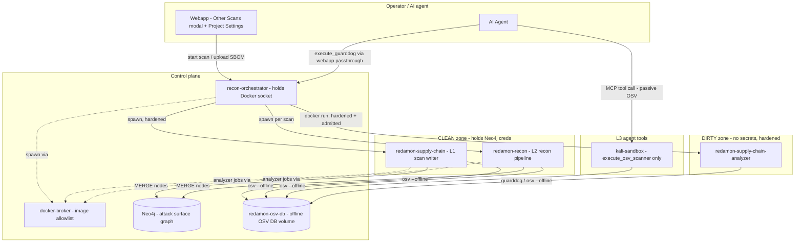
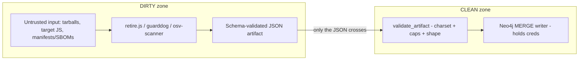
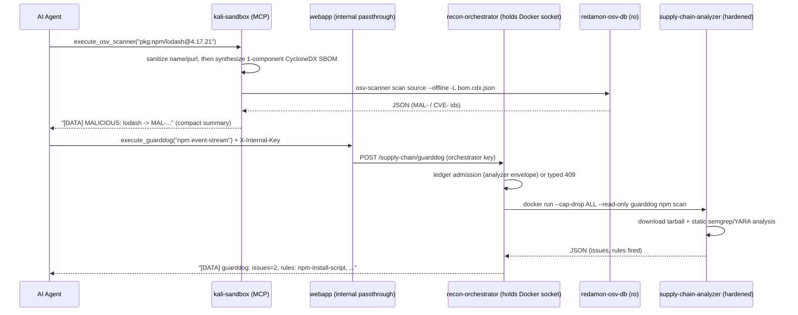
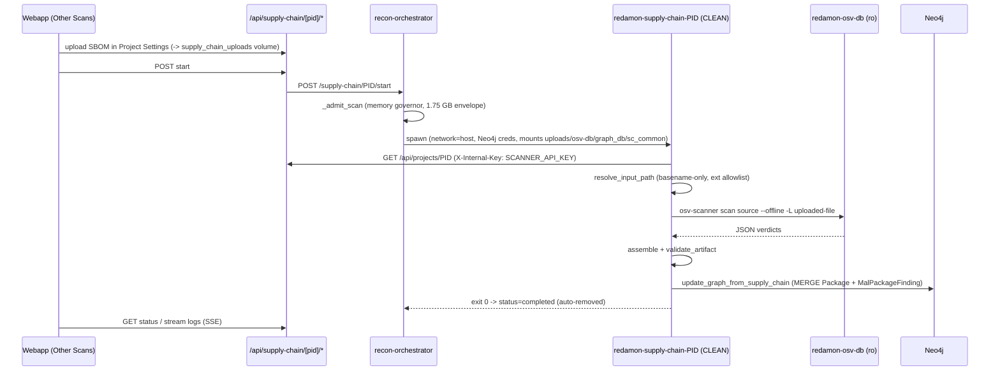
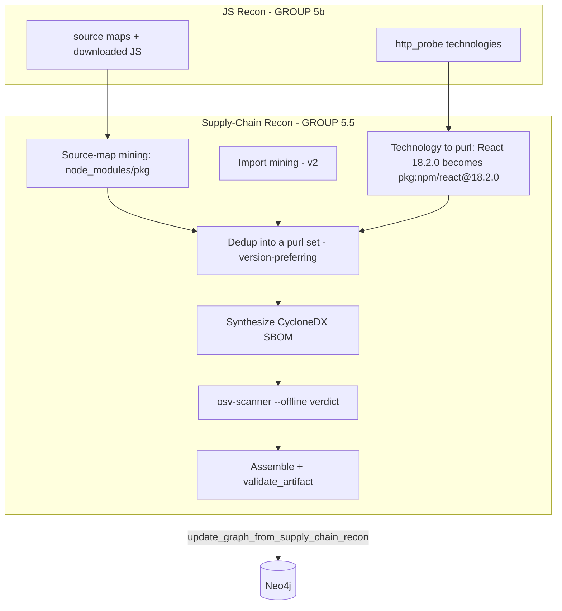
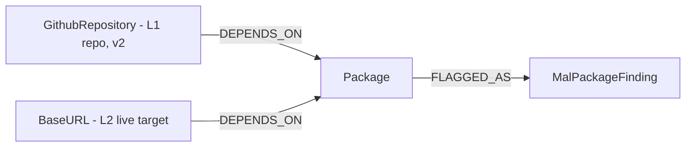
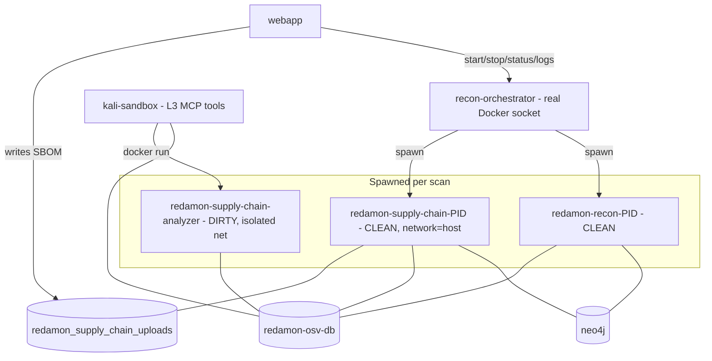

# Supply-Chain / Malicious-Package Detection

RedAmon detects **known-malicious** (`MAL-`) and **known-vulnerable** (`CVE`/`GHSA`)
software packages in a target's dependency surface, **fully offline** against a
local copy of the [OSV](https://osv.dev) database. It ships as three layers that
share one engine and one graph model, so a repository scan, a live-target harvest,
and an agent lookup all dedup into the same nodes.

This document is the technical reference: how each layer is implemented, how the
tools work, which Neo4j nodes are generated (and whether they are created or
enriched), the container topology, and how the feature integrates with the rest
of RedAmon.

- [The three layers at a glance](#the-three-layers-at-a-glance)
- [System architecture](#system-architecture)
- [The offline OSV database](#the-offline-osv-database)
- [The shared engine (`supply_chain_common`)](#the-shared-engine-supply_chain_common)
- [Security posture: the DIRTY / CLEAN split](#security-posture-the-dirty--clean-split)
- [Layer L3 - Agent tools](#layer-l3--agent-tools)
- [Layer L1 - Standalone scan (Other Scans)](#layer-l1--standalone-scan-other-scans)
- [Layer L2 - Recon pipeline module](#layer-l2--recon-pipeline-module)
- [Graph model](#graph-model)
- [The Supply-Chain SCA table](#the-supply-chain-sca-table)
- [Container topology](#container-topology)
- [Memory accounting](#memory-accounting)
- [Integration with RedAmon components](#integration-with-redamon-components)
- [v1 scope and v2 roadmap](#v1-scope-and-v2-roadmap)
- [Key files](#key-files)

---

## The three layers at a glance

| Layer | Name | What it is | Where it runs | Writes graph nodes? |
|---|---|---|---|---|
| **L3** | Agent tools | On-demand tools the AI agent calls mid-engagement | `kali-sandbox` (OSV) + `recon-orchestrator` -> analyzer (GuardDog) | No - returns text to the agent |
| **L1** | Supply-Chain Scan | Standalone audit of an uploaded SBOM / lockfile | `redamon-supply-chain-PID` (spawned) | Yes - `Package`, `MalPackageFinding` |
| **L2** | Supply-Chain Recon | Black-box harvest of a live target's served packages | `redamon-recon-PID` (recon GROUP 5.5) | Yes - `Package`, `MalPackageFinding` |

**Tools (pinned):**

| Tool | Role | Version | Runtime |
|---|---|---|---|
| **OSV-Scanner** | Verdict engine - is a package `MAL-` (malicious) or `CVE`/`GHSA` (vulnerable)? | v2.4.0 | Go static binary |
| **GuardDog** | Behavioural analysis - does the package *behave* like malware (install hooks, obfuscation, exfil, typosquat)? | v3.0.1 | Python (+ semgrep, YARA) |
| **retire.js** | Black-box JS library + version harvest (L2) | v5.4.3 | Node CLI |

A vulnerability id starting with `MAL-` is a **terminal malicious verdict** (the
package itself is malware, e.g. a typosquat). `CVE-` / `GHSA-` ids are ordinary
known-vulnerable findings and are **never** written as malicious. A GuardDog hit
is always `suspicious`, never `malicious` - only an OSV `MAL-` hit is malicious.

---

## System architecture

The whole feature is built around one idea: **separate the code that touches
untrusted bytes from the code that holds secrets.** Package tarballs, target-served
JS, and OSV/registry metadata are all attacker-influenceable; the Neo4j password,
the internal API key, and the GitHub token are not. So every operation is split
between a hardened **DIRTY** zone (no secrets, processes hostile bytes) and a
**CLEAN** zone (holds creds, writes the graph, only ever sees a validated JSON
artifact).



Kali holds **no Docker socket**: it is the least-trusted, target-facing worker, so
the one L3 tool that spawns a container (`execute_guarddog`) goes through the
orchestrator instead. See [Layer L3](#layer-l3--agent-tools).

The **shared engine** (`scanners/supply_chain_common/`) is a pure-Python package of runners
and parsers mounted read-only into every CLEAN/DIRTY container the same way
`graph_db` is mounted. The **offline OSV database** is a named Docker volume
mounted read-only everywhere except the one-time sync step.

---

## The offline OSV database

The verdict path makes **zero network calls**. A shared Docker volume
`redamon-osv-db` holds the OSV database, populated lazily per-ecosystem:

```bash
./redamon.sh supply-chain-sync npm           # ~208 MB, first run only
./redamon.sh supply-chain-sync npm PyPI Go    # add more ecosystems
```

**How the sync works** (`scanners/supply_chain_common/osv_db_sync.py`):

1. For each requested ecosystem, a minimal **seed manifest** is written to a temp
   dir (a one-line `package-lock.json`, `requirements.txt`, `go.mod`, etc.).
2. `osv-scanner scan source --offline --download-offline-databases -L <seed>`
   runs; osv-scanner recognizes the ecosystem from the seed and downloads *its*
   database into the cache directory. Using the tool's own download step keeps us
   independent of its internal on-disk layout.
3. Freshness markers (`.redamon_synced_<eco>`) bound refresh to once per 24h.
4. The DB tree is made world-readable/traversable, because osv-scanner writes it
   `0750` as root but the scan containers run **non-root + read-only** and would
   otherwise silently see an empty DB.

**How offline scanning works** (`scanners/supply_chain_common/osv_runner.py`):

- The flag is `--offline` (verified against v2.4.0). `--offline-vulnerabilities`
  does **not** load the local DB in this build and returns empty results - do not
  use it.
- The DB path is passed via the env var `OSV_SCANNER_LOCAL_DB_CACHE_DIRECTORY`.
- osv-scanner picks its extractor from the **file basename** (`package-lock.json`,
  `bom.cdx.json`), so scanned files must be named with a recognized name.
- If the DB dir is missing or empty (created by `update`/`up` but not yet synced),
  the runner returns a hard, actionable error instead of a silent false-clean.

The DB is **not** downloaded at install time (the container images are eager, the
data is lazy). `redamon.sh purge` removes the volume; `clean` keeps it.

### Automatic refresh (lazy-on-scan)

OSV publishes new `MAL-`/`CVE` advisories daily, so a DB frozen at install time
silently misses new malware. The orchestrator therefore **refreshes the DB on the
scan-spawn path**, TTL-guarded:

| Trigger | Refreshes? |
|---|---|
| Full recon (`start_recon`) | Yes - the L2 module runs in GROUP 5.5 |
| Partial recon | Only for `tool_id == SupplyChainRecon` |
| L1 Supply-Chain scan (`start_supply_chain`) | Yes |
| L3 agent tools | No - `execute_osv_scanner` runs in `kali-sandbox`, deliberately off the orchestrator network, so it rides the L1/L2 refreshes. `execute_guarddog` is behavioural and does not read the OSV DB at all. |

Semantics:

- **Cold DB (never synced): the scan path does NOT bootstrap it.** The first
  download is ~208 MB and would otherwise block the first recon spawn for minutes
  for a feature that is off by default. Cold population stays explicit
  (`redamon.sh supply-chain-sync`), matching the "images are eager, the data is
  lazy" contract. The refresh returns `skipped` in ~0.4s.
- **Populated + fresh (< TTL, default 24h):** a **~1s no-op** (`skipped`).
- **Populated + stale (> TTL):** the feed re-downloads before the scan starts
  (`synced`).
- **Best-effort:** a refresh failure (offline host, GCS unreachable) is logged and
  the scan proceeds against the existing DB, never blocked.
- **Serialized:** concurrent scan starts do not spawn two sidecars writing the
  same volume; the second caller gets `skipped` and proceeds.

**Why the orchestrator does it:** `redamon-osv-db` is mounted **read-only** into
every scan container, which also runs non-root, so a scanner physically cannot
refresh its own DB. Only the orchestrator holds the Docker socket, so it runs a
short-lived root sidecar (off the analyzer image) that writes the volume rw, then
re-applies the world-readable perms the non-root scanners need.

| Knob (orchestrator env) | Default | Meaning |
|---|---|---|
| `OSV_DB_AUTO_REFRESH` | `true` | Set `false` for a strictly air-gapped deploy (manual `supply-chain-sync` only) |
| `OSV_DB_ECOSYSTEMS` | `npm` | Ecosystems kept fresh automatically |
| `OSV_DB_TTL_SECONDS` | `86400` | Freshness window (24h) |
| `OSV_DB_REFRESH_TIMEOUT` | `900` | Hard ceiling so a slow download cannot stall a scan spawn |

All four are wired explicitly in `docker-compose.yml` (the orchestrator has **no
`env_file`**, so an unwired var would be silently inert) and need no `.env` edit.

---

## Threat-intel enrichment (the incident catalog)

A second offline dataset, independent of the OSV DB: the
[supplychainattack.org](https://supplychainattack.org) incident catalog, holding
the attacker domains, the remediation text and the typosquat labels that OSV does
not carry. It lives in the `redamon-sca-intel` volume, mounted **read-only**
everywhere, and is written only by the sync.

```bash
./redamon.sh sca-intel-sync            # ~5 MB; also refreshed automatically, below
./redamon.sh sca-intel-sync --force    # ignore the TTL and the retry floor
```

The sync fetches the feed host-pinned, byte-capped and envelope-validated, then
normalizes it into three small lookup files plus a `manifest.json` recording the
feed revision. **A rejected envelope leaves the previous files in place**: a bad
day at the publisher must never truncate good data to empty.

Every value passes a charset gate and a rejected value is **dropped and counted**,
never silently vanished, because the sync report is read as coverage:

| Class | Handling |
|---|---|
| prose sentences in the `domains` array | dropped by the hostname gate, counted |
| raw IPs in the `domains` array | routed to the IP validator instead |
| non-globally-routable IPs | dropped (`is_global`; note `is_private` does **not** cover CGNAT) |
| bare wildcards on public hosting apexes (`*.workers.dev`) | **dropped**: that is all of Cloudflare Workers |
| a specific host or a deeper wildcard under one | **kept**: it names one attacker deployment |
| OAST providers (`oastify.com`, ...) | **kept** (they are real IOCs), suppressed at match time |

### When the feed is down: the bundled offline copy

The repo ships an indicators-only snapshot of the catalog,
`scanners/supply_chain_common/sca_intel_seed.json.gz` (~115 KB), built by
[`intel_seed.py`](../../scanners/supply_chain_common/intel_seed.py). When a sync
cannot use the live feed (unreachable, an HTTP error, a rejected envelope, or a
feed with no indicators at all) and the volume holds **nothing usable**, the sync
installs this copy instead of leaving the catalog empty, and reports `seeded`.

- **Indicators only.** Hosts, wildcards, IPs, package names, typosquat pairs, and
  per incident its id, status, severity, attack-vector labels, date and link. None
  of the upstream prose (title, summary, remediation, blast radius): the catalog
  publishes no licence. Findings matched from the copy carry an incident id and
  link but an empty summary, which the webapp renders as absent.
- **Trusted by pin, then re-validated.** The file's sha256 is pinned in
  `intel_seed.py` and checked before decompression; every entry then passes the
  same gates as the live sync (hostname charset, public-apex wildcard drop,
  `is_global` IPs, package-name and advisory-id charsets, http(s)-only links).
- **Visible as such.** The installed manifest records `source: bundled-seed` and a
  revision suffixed `-bundled` (e.g. `2026-08-18-bundled`), which is what every
  finding's `incident_feed_revised` shows.
- **Never replaces live data.** A volume holding a live sync, however old, is kept
  as is; only an empty volume or an older bundled copy is (re)seeded.
- **The live feed is still retried.** The manifest is back-dated to when the
  snapshot was fetched, so the TTL never treats the copy as fresh; the retry floor
  alone paces the next attempt, and the first good sync replaces the copy.
- **Not gated by the retry floor.** The floor spares the feed, and the copy needs
  no fetch, so a sync skipped by the floor (or by the TTL) still seeds an empty
  volume, without resetting the retry clock.
- **Air-gapped deploys get it too.** With `SCA_INTEL_AUTO_REFRESH=false`,
  install/update run `./redamon.sh sca-intel-sync --seed-only`, which installs the
  copy into an empty volume inside a `--network none` container and never
  contacts the feed.

To refresh the snapshot, rebuild it from a volume holding a good live sync (the
command is in the module docstring) and update `SEED_SHA256`; the build is
byte-reproducible.

### Automatic refresh (lazy-on-scan)

Same mechanism as the OSV DB above, on the same three spawn paths (full recon,
partial recon for `SupplyChainRecon`, and the L1 scan), TTL-guarded and
best-effort: a refresh failure is logged and the scan proceeds.

Two deliberate differences from the OSV refresh, both because this feed is 5 MB
rather than 208 MB:

- it **may bootstrap a cold volume** on the scan path (the OSV cold guard exists
  only to avoid a multi-minute stall on the first spawn);
- the sidecar ceiling is 120s, not 900s.

There is also a **retry floor** the OSV path has no need for. The envelope
contract keeps the previous files on rejection, so `manifest.json` never advances
while the feed is broken, and a TTL-only check would re-fetch on every single scan
spawn. A separate attempt marker bounds that to one attempt per hour.

Readers are long-lived (the webapp, `traffic-ingest`), so they re-check
`manifest.json`'s mtime at most once a minute and reload when it changed. A
re-sync therefore applies within that window without a restart, at a cost of one
`stat` per window rather than one per captured request.

| Knob (orchestrator env) | Default | Meaning |
|---|---|---|
| `SCA_INTEL_AUTO_REFRESH` | `true` | `false` for a strictly air-gapped deploy: the feed is never contacted, but an empty catalog still gets the bundled offline copy at install/update (`sca-intel-sync --seed-only`, run with no network) |
| `SCA_INTEL_TTL_SECONDS` | `86400` | freshness window (24h) |
| `SCA_INTEL_RETRY_SECONDS` | `3600` | retry floor after a failed or rejected fetch |
| `SCA_INTEL_REFRESH_TIMEOUT` | `120` | hard ceiling on the sidecar |
| `SCA_INTEL_BOOTSTRAP_ON_SCAN` | `true` | allow cold population on the scan path |
| `SCA_INTEL_MATCH_ENABLED` | `true` | kill switch for the traffic match (A1), not in the UI |

### What it feeds

| | What it adds | Where it shows |
|---|---|---|
| **Incident context** | 7 `incident_*` properties on findings that **already exist** | SCA table, Verdicts sheet (expandable row) |
| **Malicious hosts (recon)** | `ThreatPulse` + `CONTACTS_MALICIOUS_HOST` from a `BaseURL` | Threat Intel table + the graph |
| **Malicious hosts (traffic)** | 2 columns on the captured request | Traffic page, `ioc` flag |
| **Typosquats** | `MalPackageFinding` with `source_tool: typosquat` | SCA table, Verdicts sheet |

Three things this deliberately does **not** do:

- **It never changes a verdict.** Only an OSV `MAL-` id makes a package
  malicious; a catalog match is name-only and therefore weaker evidence.
- **It never invents a node for the attacker host.** That host is a third party
  the target contacts, not part of the target's attack surface, so it lives on
  the relationship. The `BaseURL` is MATCHed, never MERGEd.
- **It never reuses `APPEARS_IN_PULSE`.** That edge means "this asset of mine is
  named in the report", which is false here, and reusing it would inject these
  findings into the Red Zone's OTX arms and the report's OTX section.

### Scope, stated precisely

Of the 364 incidents carrying attacker domains, roughly 74 are browser-side
(compromised script, CDN hijack, skimmer) and ~89 are install-time (a
`postinstall` calling home during `npm install`). RedAmon observes browser traffic
and the JS recon downloads, so it catches the **browser-side class**. Do not
describe this as detecting supply-chain attacks in general.

Also note ~98% of the catalog's package IOCs originate from the GitHub Advisory
Database and are therefore already in the offline OSV DB. The value here is the
domains, the remediation text and the typosquat labels, not the package list.

### Staleness is recorded, not prevented

`incident_feed_revised` on every enriched finding and `manifest.json` in the
volume let an operator reconstruct which feed revision produced any enrichment.
A **Scan Timeline snapshot serializes all node properties with no allowlist**, so
these ride along and restoring an old version restores the enrichment as it was
at snapshot time. That is intended: the feed revision is what makes a restored
snapshot interpretable.

There is no UI indicator of intel age. An air-gapped deploy, a host whose feed has
been failing for a month, and a freshly synced one look identical from inside the
product. The same gap applies to the OSV DB and the GuardDog rule set.

---

## The shared engine (`supply_chain_common`)

A top-level Python package, mounted read-only into the recon / scan / analyzer
containers like `graph_db`. It holds only pure runners and defensive parsers - no
secrets, no graph writes.

| Module | Responsibility |
|---|---|
| `osv_runner.py` | `run_osv_scan(target, mode, db_path)` shells out to osv-scanner offline; `parse_osv_json` splits `MAL-` from `CVE-/GHSA-`. |
| `guarddog_runner.py` | `scan_package` / `verify_lockfile`; `parse_guarddog` normalizes the scan-object and verify-list shapes, applies the severity map. |
| `retire_runner.py` | `scan_js_dir` over downloaded JS; `parse_retire_json`; `to_purls`. |
| `purl.py` | Canonical package-URL construction (`pkg:npm/lodash@4.17.21`), npm-scope `%40` encoding, Maven `group:artifact` -> namespace/name, PyPI PEP 503 normalization. |

> **retire.js needs egress, and two of its behaviours look like "clean".**
> Unlike osv-scanner, retire.js is **not** offline. It downloads
> `jsrepository-v5.json` from `raw.githubusercontent.com` on **every** run: it
> caches to `/tmp/.retire-cache`, and the analyzer's `/tmp` is a tmpfs, so
> nothing survives between jobs. Two consequences worth knowing before reading
> an empty L2 result as good news:
>
> 1. **A failed repository download still writes well-formed JSON** - `data` is
>    empty and the reason appears only in `errors`. `scan_js_dir` therefore
>    treats a non-empty `errors` array as a run failure rather than trusting
>    the exit code, which `--exitwith` already reassigns.
> 2. **retire.js only reports components that carry known vulnerabilities.** A
>    file it positively identifies as a clean version reports identically to a
>    file it did not recognise at all. retire.js is a vulnerable-library
>    detector, not an inventory source - the OSV pass that follows can only
>    re-verdict what retire already flagged (it still earns its place: it adds
>    `MAL-` advisories, severity and CVSS that retire does not carry).
| `security.py` | `sanitize_name` / `sanitize_purl` / `sanitize_version` (strict charset gate before any subprocess/filename), and `validate_artifact` (the DIRTY->CLEAN boundary). |
| `artifact.py` | Shared artifact assembly (`empty_artifact`, `add_osv_findings`, `add_guarddog_findings`, `to_cyclonedx`, `osv_mode_for_path`). |
| `osv_db_sync.py` | Lazy per-ecosystem OSV DB population. |
| `_run.py` | `run_argv` - `shell=False` subprocess with timeout + ANSI strip; never raises on a "findings present" non-zero exit. |

Every function that reaches a subprocess or a filename first passes untrusted
names through `sanitize_name` (charset allowlist, rejects `..`, shell metacharacters,
leading `-`/`/`, control chars). All shell-outs are `shell=False` with a list argv.

**The artifact** is the single JSON document that crosses the DIRTY->CLEAN
boundary:

```json
{
  "schema_version": 1,
  "mode": "lockfile | sbom | dir | js-dir | purls",
  "packages":   [{"purl","name","version","ecosystem","source","source_path"}],
  "malicious":  [{"purl","name","version","ecosystem","advisory_id","severity","confidence","title","aliases"}],
  "vulnerable": [{"purl","name","version","ecosystem","advisory_id","severity","confidence","title"}],
  "suspicious": [{"name","version","ecosystem","rule","severity","confidence","message","soft_error"}],
  "errors":     ["..."]
}
```

`validate_artifact` rejects unknown fields, caps array sizes (truncating with a
recorded error rather than dropping a verdict), caps string lengths, and
charset-validates every `purl` / `version` / `ecosystem` / `advisory_id` - so a
compromised analyzer cannot smuggle a path-traversal or shell payload into the
trusted zone.

---

## Security posture: the DIRTY / CLEAN split



| Control | Where |
|---|---|
| **DIRTY sandbox** `cap_drop=ALL`, `read_only` rootfs + tmpfs, non-root, mem/pids/cpu caps, **no secrets** | `run_supply_chain_analyzer` (modeled on `codefix_sandbox`) |
| **Network isolation** - OSV path zero-egress; GuardDog registry-egress opt-in, fails closed | dedicated `redamon-supply-chain-net` bridge |
| **NO-INSTALL invariant** - never run `npm/pip/... install` on a target manifest (lifecycle scripts = RCE); static parse only | CI grep test over supply-chain source |
| **Name sanitization** (S6/S7) - charset allowlist before any subprocess/filename | `sanitize_name` |
| **DIRTY->CLEAN boundary** (S5) - schema-validate the artifact | `validate_artifact` |
| **SSRF guard** (S4) - L2 makes no new fetches; it parses data JS-recon already downloaded | `harvest.py` (no `requests.get`) |
| **Tenant isolation** (S10) - every MERGE key includes `user_id` + `project_id` | `supply_chain_mixin.py` |
| **Broker allowlist** - `redamon-supply-chain-analyzer` + `redamon-supply-chain` images + `redamon-osv-db` volume | `services/docker_broker/broker.py` |

The `redamon-supply-chain-analyzer` and `redamon-supply-chain` images and the
`redamon-osv-db` volume are on the docker-broker allowlist; a non-allowlisted
image is denied.

---

## Layer L3 - Agent tools

Two tools the AI agent calls mid-engagement. **L3 writes no graph nodes** - it
returns compact text summaries the agent reasons over (framed as data, never
instructions).

They run in **two different lanes**, split by trust, not by convenience:

| Tool | Lane | Why |
|---|---|---|
| `execute_osv_scanner` | Kali MCP (`network_recon_server.py`) | Passive, fully offline, reads a read-only DB. Nothing dangerous to isolate. |
| `execute_guarddog` | Agent -> webapp -> **orchestrator** (`agentic/supply_chain_tools.py`) | Downloads an attacker-authored tarball, so it must run in the hardened analyzer image, and only the orchestrator holds the Docker socket. |



- **`execute_osv_scanner`** - passive, fully offline. Accepts a purl (synthesized
  into a one-component CycloneDX SBOM), a workspace lockfile path, or an SBOM
  path. Reads `redamon-osv-db`, zero egress. `MAL-` = terminal malicious verdict;
  `CVE-`/`GHSA-` = known-vulnerable. Parsing is inline in
  `network_recon_server.py` (kali is a separate image that does not import
  `supply_chain_common`).
- **`execute_guarddog`** - DANGEROUS (downloads an attacker-authored tarball).
  Kali never touches Docker: kali is the least-trusted, target-facing worker
  (`seccomp:unconfined` + `NET_RAW`), so handing it a socket would be the wrong
  trust boundary. The agent reaches the orchestrator through the webapp's
  internal passthrough (only the webapp holds `ORCHESTRATOR_API_KEY`), and the
  orchestrator spawns the analyzer with `cap_drop=ALL`, `read_only` and governed
  resource caps. A hit is `suspicious`, never a terminal verdict. A memory
  refusal comes back as an explicitly **retryable** 409, never as a clean result.

Registered in `agentic/prompts/tool_registry.py`; phase-gated in
`agentic/project_settings.py` (`execute_osv_scanner` -> all phases;
`execute_guarddog` -> informational + exploitation, and in `DANGEROUS_TOOLS`).

**Node generation:** none. L3 is a read-only intelligence lookup for the agent.

---

## Layer L1 - Standalone scan (Other Scans)

The operator configures the input - an uploaded SBOM / lockfile, a GitHub
repository, or an organization to batch - in **Project Settings -> Other Scans ->
Supply Chain Scanner**, then starts the scan from the card of the same name in
the **Other Scans** modal (the card holds the run controls only, and Start is
disabled until an input is configured). The orchestrator spawns a CLEAN writer
container that runs a static, offline osv-scanner pass and MERGEs the results
into the graph.



**Implementation:**

- **Lifecycle** (`recon_orchestrator/container_manager.py::start_supply_chain`,
  modeled on `start_trufflehog`): memory admission, spawn, `get/pause/resume/stop`,
  SSE log streaming (offloaded to the log-stream executor), auto-remove on finish,
  and registration in `_active_scan_keys` so the governor accounts for it. REST
  endpoints live at `recon_orchestrator/api.py` (`/supply-chain/PID/*`); the
  webapp proxies them at `webapp/src/app/api/supply-chain/[projectId]/*`.
- **The CLEAN writer** (`scanners/supply_chain_scan/`): fetches settings from the webapp
  API using the scoped `SCANNER_API_KEY`, validates the uploaded filename
  (basename-only, extension allowlist, no traversal), runs osv-scanner offline via
  `supply_chain_common`, assembles + validates the artifact, and writes the graph
  with `Neo4jClient` (it holds the Neo4j creds; the DIRTY analyzer does not).
- **Input safety:** the uploaded file lands in the `redamon_supply_chain_uploads`
  named volume under a per-project subdir; the scan mounts it **read-only**, so
  project A cannot read project B's SBOM.

**Nodes generated by L1:**

| Node | Create or enrich? | How |
|---|---|---|
| `Package` | **Create or enrich** | MERGE on `(purl, user_id, project_id)`. A first sighting is created; a package already present from another scan/layer is enriched (`last_seen` + props updated). |
| `MalPackageFinding` | **Create or enrich** | MERGE on `(finding_id, user_id, project_id)`. The verdict is created or its props refreshed. |
| `(Package)-[:FLAGGED_AS]->(MalPackageFinding)` | Create | Links each verdict to its package. |

L1 v1 input is an **uploaded SBOM / lockfile**, which has no repository/URL parent
in the graph, so its `Package` nodes **float** (no `DEPENDS_ON` edge). GitHub-repo
input (which would anchor to a `GithubRepository` node) is v2. L1 does **not**
mutate any pre-existing non-supply-chain node.

---

## Layer L2 - Recon pipeline module

During recon, against the **live target with no manifest**, L2 harvests the npm
package set the target actually serves, verdicts it offline, and MERGEs the same
node types - anchored to the target's `BaseURL` nodes. It runs as **GROUP 5.5** of
the pipeline, immediately after JS Recon (whose output it consumes), and is also
runnable standalone as a **partial recon** tool.



**The harvest chain** (`recon/helpers/supply_chain/harvest.py`) is **pure parsing
of data JS-recon already downloaded - it makes no new network request**, which
satisfies the SSRF control (S4) by construction:

1. **Source-map mining** - extract `node_modules/(@scope/)?<pkg>` from the
   `sources[]` of source maps JS-recon already fetched. Exact npm names, no
   versions (nested `node_modules` and scoped packages handled).
2. **Import mining** - bare specifiers from JS `import`/`require`.
3. **Technology -> purl** - map `http_probe` technologies (the real
   `"Name:Version"` strings, e.g. `React:18.2.0`) to npm purls with versions.

A fourth source, **retire.js**, runs separately (inside the dirty analyzer,
since it parses attacker-served bytes) and its artifact is merged in. It is the
only source that reads a name **and a version** straight out of the served
JavaScript, so it is the only one that can verdict a library absent from the
15-entry technology alias table.

Names without a version (source-map/import mining) are recorded as `Package`
nodes for inventory but **cannot be OSV-verdicted** (osv-scanner needs a version
to match a version-specific advisory); verdicts come from the version-bearing
sources - technologies and retire.js. The harvest is deduped into a purl set,
synthesized into a CycloneDX SBOM, and scanned offline. The result is stored on
`combined_result['supply_chain_recon']` and written by
`_graph_update_bg("update_graph_from_supply_chain_recon", ...)`.

> **Dedup identity is `(ecosystem, name)`, never the purl string.** A versioned
> sighting always beats a versionless one, and the rule has to hold in *two*
> places: inside `harvest_packages` (across its three sources) and inside
> `merge_artifacts` (where the retire.js artifact is folded in). Keying the
> latter on the purl made `pkg:npm/lodash` and `pkg:npm/lodash@4.17.4` two
> different keys, so one library became two `Package` nodes - one of them
> permanently unverdictable.

**Pipeline placement** (`recon/main.py`): GROUP 5.5, gated on
`SUPPLY_CHAIN_RECON_ENABLED`, after `run_js_recon` so its `source_maps` +
`technologies` are available. Settings live in `recon/project_settings.py`
(`SUPPLY_CHAIN_RECON_ENABLED`, `_ECOSYSTEMS`, `_DEEP_ANALYSIS_ENABLED`).

**Partial recon** (`recon/partial_recon_modules/supply_chain.py`, tool id
`SupplyChainRecon`): reuses the full JS-recon flow to fetch the served JS, then
runs the harvest + verdict + graph write standalone. Inputs are `BaseURL` /
`Endpoint` URLs from the graph plus user-provided URLs.

**Nodes generated by L2:**

| Node / edge | Create or enrich? | How |
|---|---|---|
| `Package` | **Create or enrich** | MERGE on `(purl, user_id, project_id)`; `source` = `sourcemap` / `wappalyzer` / `import` / `osv`. Dedups with L1's packages of the same purl. |
| `MalPackageFinding` | **Create or enrich** | MERGE on `(finding_id, user_id, project_id)`. |
| `(BaseURL)-[:DEPENDS_ON]->(Package)` | Create - **enriches the existing `BaseURL`** | Anchored to each served base URL, normalized to `scheme://netloc`. The edge is created **only when the `BaseURL` node already exists** (recon created it earlier); L2 never invents target nodes. |
| `(Package)-[:FLAGGED_AS]->(MalPackageFinding)` | Create | Links verdict to package. |

So L2 **enriches** the existing attack-surface graph: it adds `DEPENDS_ON` edges
from the recon-discovered `BaseURL` nodes to the new `Package` nodes, without
mutating the `BaseURL` nodes themselves.

---

## Graph model

Two node types, shared by L1 + L2 (so a repo/SBOM scan and a live scan of the same
project dedup into the same nodes). Constraints in `graph_db/schema.py`; writer in
`graph_db/mixins/supply_chain_mixin.py`.



**`Package`** - a discovered dependency.

| Property | Notes |
|---|---|
| `purl` | canonical package URL, e.g. `pkg:npm/lodash@4.17.21` (part of the MERGE key) |
| `ecosystem` | `npm`, `PyPI`, `Go`, `Maven`, `crates.io`, `Packagist`, `RubyGems`, `NuGet` |
| `name`, `version` | `version` nullable (L2 black-box may not know it) |
| `source` | `sbom` / `lockfile` / `sourcemap` / `retirejs` / `import` / `wappalyzer` / `osv` / `finding` |
| `source_path` | which manifest the package came from (an L1 repo scan walks every lockfile in the tree). Written with `coalesce`, so a later versionless L2 sighting of the same purl cannot erase it |
| `user_id`, `project_id` | tenant scope |
| `first_seen`, `last_seen` | `ON CREATE SET first_seen`; `SET last_seen` unconditional |

Merge key: `(purl, user_id, project_id)`.

**`MalPackageFinding`** - a verdict about a package.

| Property | Notes |
|---|---|
| `finding_id` | `sha256(purl + ':' + advisory_or_rule)[:16]` (part of the MERGE key) |
| `verdict` | `malicious` (OSV `MAL-`) or `suspicious` (GuardDog) |
| `source_tool` | `osv` or `guarddog` |
| `advisory_id` | `MAL-...` / `CVE-...` / `GHSA-...` or a GuardDog rule name |
| `severity`, `confidence`, `title`, `detail` | display fields |
| `soft_error` | `true` when the behavioural pass produced **no** verdict (download failed, budget exhausted, dispatch error). The distinction "GuardDog ran and found nothing" vs "GuardDog never ran" only survives to the UI because this is persisted |
| `aliases` | OSV alias ids for the advisory (a `MAL-` usually also carries a `GHSA-`), capped at 50 |
| `user_id`, `project_id` | tenant scope |
| `first_seen`, `last_seen` | as above |

Merge key: `(finding_id, user_id, project_id)`.

**Rules**

- All writes MERGE (`ON CREATE SET first_seen`, unconditional `SET last_seen`) -
  running twice yields the same node count (idempotent).
- The finding path **MERGEs the `Package`** (not MATCH), so a finding whose package
  was not in the harvested set (a GuardDog name-only hit) still attaches - there is
  never an orphaned `MalPackageFinding`.
- Only OSV `MAL-` ids become `verdict=malicious`. `CVE-`/`GHSA-` stay in the raw
  JSON output and are **not** written as findings.
- Every MERGE key is tenant-scoped; the `querySupplyChain` report path filters
  `{project_id}` and goes through the project-access guard.

**Create vs enrich, summarized:** `Package` and `MalPackageFinding` are always
**create-or-enrich** (MERGE), which is how the three layers converge. The only
existing nodes L2/L1 touch are `BaseURL` (L2) and, in v2, `GithubRepository` (L1),
which they **enrich with a `DEPENDS_ON` edge** but never mutate.

---

## The Supply-Chain SCA table

Everything above writes into the graph; this is where an operator reads it. The
**Supply-Chain SCA** entry in the graph page's table dropdown
(`webapp/src/app/graph/components/RedZoneTables/SupplyChainScaTable.tsx`, served
by `/api/analytics/redzone/supplyChainSca`) is the only view that joins the three
node types together, and it has three sheets:

| Sheet | One row per | Answers |
|---|---|---|
| **Verdicts** | `MalPackageFinding` | what is on fire right now |
| **Packages** | `Package`, with rolled-up counts | what am I running, and how much of it was actually checked |
| **Advisories** | `Vulnerability {source:'osv'}` | the `CVE`/`GHSA` half, which has no other UI |

Three things the table derives rather than reads:

- **Verdict is three-state, not two.** `malicious` / `suspicious` / **`not analysed`**.
  A finding with `soft_error` (or the legacy `advisory_id = 'guarddog-not-run'`)
  is a package GuardDog never verdicted, and it is rendered as unchecked rather
  than as a low-severity suspicious hit.
- **`unverdictable`** is a first-class package status and a headline count.
  osv-scanner needs a version to match a version-specific advisory, so a
  package harvested without one (source-map and import mining never yield a
  version) was **never checked**. A short verdict list next to a large
  `unversioned` count means "mostly unchecked", not "mostly clean".
- **Origin** (L1 repo / L1 SBOM / L2 live) comes from the anchor label, since
  the layer is not stored on the node.

Query shape worth knowing: `update_graph_from_supply_chain_recon` writes the whole
artifact **once per BaseURL**, so a target with 30 probed base URLs gives every
package 30 `DEPENDS_ON` edges. The route therefore collects anchors with pattern
comprehensions; a row-wise `OPTIONAL MATCH` would fan every finding out 30 times.

---

## Container topology



| Container | Zone | Lifecycle | Holds Neo4j creds? | OSV DB | Network |
|---|---|---|---|---|---|
| `redamon-supply-chain-PID` (L1) | CLEAN | spawned per scan, auto-removed | Yes | ro | host (reach Neo4j at `localhost:7687`) |
| `redamon-recon-PID` (L2) | CLEAN | spawned per recon scan | Yes | ro (mounted at spawn) | host |
| `redamon-supply-chain-analyzer` | DIRTY | `docker run` per GuardDog call (L2 deep analysis, and L3 `execute_guarddog`) | **No** | ro | registry egress required; `cap_drop=ALL`, read-only rootfs, non-root uid 1001, pid/mem caps |
| `kali-sandbox` (L3) | tool | long-lived | no (uses scoped tokens) | ro | internal |

Build-time: the two supply-chain images build under `--profile tools`
(`redamon-supply-chain`, `redamon-supply-chain-analyzer`); `osv-scanner` is baked
into `recon` and `kali-sandbox`; `supply_chain_common` is **mounted** (hot-reload,
no rebuild) into recon / scan / analyzer at spawn.

---

## Memory accounting

Supply-chain is the only RedAmon feature that spawns a **second heavy container per
job**: the dirty analyzer. That makes it the one place where "the scan container's
`mem_limit` covers it" is false, so it needs its own accounting in the
[memory governor](README.MEMORY_GOVERNOR.md).

| Unit | Envelope (booked) | Hard cap (`mem_limit`) | Booked by |
|---|---|---|---|
| L1 scan (`supply_chain`) | 1.75 GB | envelope x 1.5 | `_admit_scan("supply_chain", …)` |
| Supply-chain partial (`partial_recon:SupplyChainRecon`) | 1.75 GB | envelope x 1.5 | `_admit_scan(_partial_kind(tool_id), …)` |
| L2 inside full recon | rides `full_recon` (2 GB) | recon's cap | the parent scan |
| Dirty analyzer (`supply_chain_analyzer`, **tool** envelope) | 1 GB | ~1.5 GB | L3 only (see below) |

Three things are worth knowing:

- **The analyzer is a tool, not a scan.** It is sized from
  `tool_container_envelope_bytes["supply_chain_analyzer"]`, not from whichever scan
  dispatched it. It used to be capped by the L1 scan's envelope, which made no sense for
  an L3 call that has no L1 scan anywhere near it. The envelope is the *expected peak*
  (1 GB); `container_cap()` applies the 1.5x headroom to reach the ceiling.
- **All three spawn paths resolve the same number.** The orchestrator uses the Docker
  SDK; the recon and L1 containers shell out through the broker socket. Only the first
  could reach `container_manager`, so the other two hardcoded `1500m` and never shrank
  under memory pressure. `scanners/supply_chain_common/analyzer_dispatch.py` now resolves
  `--memory` from the governor for every caller, falling back to the literal when the
  governor is unreachable (the analyzer image has no `graph_db`). Precedence is
  `SUPPLY_CHAIN_ANALYZER_MEM` > governor > literal, **read at call time**, identical on
  both sides; an override larger than the tool envelope also raises what L3 admission
  reserves, so the ledger never promises less than the container is allowed to use.
- **L3 books a reservation.** `execute_guarddog` spawns a real container, so the
  orchestrator admits it against the ledger before spawning and releases in a `finally`.
  A full host returns a typed 409, which the agent tool renders as an explicitly
  **retryable** condition carrying "the package was NOT analyzed" - a refusal must never
  read as a clean verdict, the same false-clean class as `soft_error`.

The L2 import-mining caps (`SUPPLY_CHAIN_IMPORT_MAX_FILES` / `_MAX_BYTES`) are genuine
in-memory accumulators and are byte-budgeted by `apply_memory_governor`. They live in
`recon/project_settings.py`, not as module-level `os.environ` reads, because the governor
only walks the settings dict. `SUPPLY_CHAIN_DEEP_MAX_PACKAGES` is deliberately **not**
budgeted: GuardDog runs the packages sequentially, so that knob bounds wall-clock, not RAM.

---

## Integration with RedAmon components

| RedAmon component | How supply-chain integrates |
|---|---|
| **recon-orchestrator** | Owns the L1 + L2 + analyzer lifecycle via the Docker SDK; `_active_scan_keys` + `_admit_scan` account for the 1.75 GB envelope (and for in-flight L3 GuardDog jobs); `cleanup()` and `refresh_all_scan_states()` sweep supply-chain so containers and reservations never leak. |
| **Memory governor** | Fully accounted, see [Memory accounting](#memory-accounting): per-scan envelopes for L1 and the supply-chain partial, a `supply_chain_analyzer` **tool** envelope shared by all three analyzer spawn paths, ledger admission for L3 GuardDog, and byte-budgeted import-mining caps. Details in [README.MEMORY_GOVERNOR.md](README.MEMORY_GOVERNOR.md). |
| **docker-broker** | The two images + the `redamon-osv-db` volume are allowlisted; a look-alike image is denied. |
| **Neo4j / graph_db** | `SupplyChainMixin` is added to `Neo4jClient`; two `CREATE CONSTRAINT`s in `graph_db/schema.py`. The agent's `query_graph` sees `Package` / `MalPackageFinding` like any other node. |
| **Webapp** | Prisma fields (`supplyChain*`, `supplyChainRecon*`); `/api/supply-chain/[projectId]/*` proxy routes + SBOM upload; `useSupplyChainStatus` / `useSupplyChainSSE` hooks; a Supply Chain card in the Other Scans modal (run controls + logs drawer) and the Supply Chain Scanner settings section that owns its input. |
| **Graph tables** | The **Supply-Chain SCA** table (`/api/analytics/redzone/supplyChainSca`) reads this model directly: three sheets (Verdicts / Packages / Advisories) over `Package`, `MalPackageFinding` and `Vulnerability {source:'osv'}`. Not to be confused with **JS Dep Signals** (formerly labelled "Supply-Chain"), which reads `JsReconFinding` nodes. See [the table section](#the-supply-chain-sca-table). |
| **Settings (5 layers)** | Prisma default -> `recon/project_settings.py` (L2) / `scanners/supply_chain_scan/project_settings.py` (L1) -> `/defaults` -> webapp section, using the `x_enabled` / `xEnabled` / `X_ENABLED` naming. |
| **redamon.sh** | `supply-chain-sync` populates the DB; `TOOL_IMAGES` + `cmd_update` build/rebuild the two images; `cmd_install`/`up` build them via `--profile tools`. |
| **SCANNER_API_KEY (S3/E6)** | The L1 scan container fetches settings with the scoped `SCANNER_API_KEY` (falling back to `INTERNAL_API_KEY` on pre-secret installs); the analyzer holds no key at all. |

---

## v1 scope and v2 roadmap

**v1 (shipped):**

- L1 input: an uploaded **SBOM / lockfile** (static, offline). Nodes float (no repo anchor).
- L2: source-map + technology harvest + offline OSV verdict; anchored to `BaseURL`.
- L2 **GuardDog deep analysis** (opt-in, flagged-package-only) -> `suspicious` findings.
- L3: `execute_osv_scanner` (offline) + `execute_guarddog` (dispatched to the analyzer).

**Deep behavioural analysis (GuardDog), L2 — implemented 2026-08-07**

Gated on `SUPPLY_CHAIN_RECON_DEEP_ANALYSIS_ENABLED` (off by default). After the
offline OSV pass, `deep_analyze()` in `supply_chain_recon.py` takes the packages
OSV **already flagged** (malicious first, capped at
`SUPPLY_CHAIN_DEEP_MAX_PACKAGES`, default 10), maps the OSV ecosystem brand to
GuardDog's slug, and runs `guarddog <eco> scan` **inside the dirty analyzer
image**, spawned through the broker socket the recon container already holds
(`DOCKER_HOST=unix:///var/run/broker/docker.sock`). The recon process holds the
Neo4j creds and never unpacks a tarball itself.

Results become `suspicious` findings (`verdict=suspicious`,
`source_tool=guarddog`, `advisory_id=<rule>`), carrying the **versioned purl**
so they attach to the existing `Package` node. A download failure becomes a
`soft_error` finding, never a silent clean. A GuardDog hit is never malicious —
only an OSV `MAL-` id is.

> **`--no-sandbox` is required, and deliberate.** GuardDog 3.x auto-detects and
> builds its own kernel-level sandbox around the extraction step. Inside a
> container it cannot, and it fails *silently*: exit 0, `issues: 0`, the real
> cause buried in `errors["download-package"]`. Verified on 3.0.1 that it fails
> identically with and without `--cap-drop ALL` / `--read-only`, so it is the
> container context, not our hardening. The **analyzer container is the
> sandbox** (`cap_drop=ALL`, read-only rootfs, non-root uid 1001, pid/memory
> caps, no secrets) — a stronger boundary than GuardDog's in-process one, and
> the reason the dirty analyzer exists. Never run `guarddog` outside that image.

**Also shipped since the list below was written:**

- **L1 GitHub-repo input** (`SUPPLY_CHAIN_REPO_URL` + `scanners/supply_chain_scan/repo_clone.py`,
  anchored to `GithubRepository`).
- **GitHub Enterprise host support** (both the single-repo input and the org batch).
  The host is operator input that becomes a server-side fetch **and** `git clone` argv,
  so it is allowlisted, never free-form: `webapp/src/lib/github/ownerTarget.ts`
  (`parseOwnerTarget`) accepts github.com plus the single `UserSettings.githubEnterpriseHost`
  the operator registered, and `repo_clone.parse_repo_target` re-checks the same
  allowlist inside the container. Credentials are selected **by host**
  (`supplyChainGithubToken` vs `githubEnterpriseToken`), so neither token can reach the
  other server; an unrecognised host gets none. The host travels to the scan as
  `SUPPLY_CHAIN_REPO_OVERRIDE_HOST` (batch item) and is surfaced as
  `SUPPLY_CHAIN_GITHUB_HOST`, with the allowlist as `SUPPLY_CHAIN_GHE_HOST`.
- **GuardDog in L1** (`scanners/supply_chain_scan/deep_analysis.py`): the scan container now does
  get the **broker** socket and `DOCKER_HOST`, the same narrow privilege recon already
  had, so it can dispatch to the dirty analyzer without a raw Docker socket.
- **GuardDog from L3 in practice**: it no longer runs from `kali-sandbox` at all. The
  agent calls the orchestrator (`POST /supply-chain/guarddog`), which holds the Docker
  socket, so the least-trusted target-facing worker never touches Docker. See the
  trust-boundary section of [README.TM.SYSTEM_OVERVIEW.md](README.TM.SYSTEM_OVERVIEW.md).

**Deferred to v2:**

- Non-`MAL` OSV ids (`CVE`/`GHSA`) routed to the existing CVE node path.

---

## Key files

```
scanners/supply_chain_common/            # shared engine: runners, parsers, security, artifact, db sync
scanners/supply_chain_common/analyzer_dispatch.py  # ONE hardened argv for all 3 analyzer spawners
scanners/supply_chain_analyzer/          # DIRTY image + entrypoint (sc-analyze)
scanners/supply_chain_scan/              # L1 CLEAN writer (main, runner, project_settings, Dockerfile)
recon/helpers/supply_chain/harvest.py            # L2 black-box harvest (pure, no network)
recon/main_recon_modules/supply_chain_recon.py   # L2 pipeline module (GROUP 5.5)
recon/partial_recon_modules/supply_chain.py      # L2 partial recon
graph_db/mixins/supply_chain_mixin.py            # Package + MalPackageFinding writer
graph_db/schema.py                               # uniqueness constraints
graph_db/resource_governor.py                    # envelopes + container_cap (memory accounting)
mcp/servers/network_recon_server.py              # L3 execute_osv_scanner (passive, in kali)
agentic/supply_chain_tools.py                    # L3 execute_guarddog (dispatched to orchestrator)
recon_orchestrator/{container_manager,api,models}.py  # L1 lifecycle + REST + L3 guarddog admission
webapp/src/app/api/supply-chain/                 # proxy routes + SBOM upload
webapp/src/components/projects/ProjectForm/sections/SupplyChainSection.tsx
webapp/src/app/api/analytics/redzone/supplyChainSca/route.ts    # SCA table API (3 sheets)
webapp/src/app/graph/components/RedZoneTables/SupplyChainScaTable.tsx  # the table
graph_db/schema_sections.md                            # node documentation (THE declaration)
```
